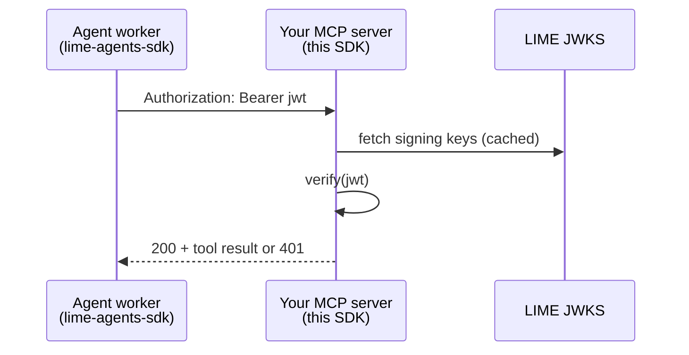

# lime-mcp-server-sdk

Python library for **your MCP server** — the service that exposes tools and checks that
the caller is a real LIME agent.

[](https://pypi.org/project/lime-mcp-server-sdk/)
[](https://lime-mcp-server-sdk.readthedocs.io/)
[](https://github.com/Mawyxx/lime-mcp-server-sdk)

## Who is this for?

You run an **MCP resource server** (FastMCP, custom HTTP, etc.). Agents call your server
with `Authorization: Bearer <jwt>`. This SDK answers:

> Is this JWT issued by LIME for **this** resource server, and which agent is it?

!!! warning "This SDK does not"
    - Issue tokens → use [lime-agents-sdk](https://lime-agents-sdk.readthedocs.io/)
    - Handle website login → use [lime-sites-sdk](https://lime-sites-sdk.readthedocs.io/)

## One scenario — verify MCP Bearer token



## Class structure: `TokenVerifier`

| Step | Method | Signature (short) | Returns |
|------|--------|-------------------|---------|
| 1 | `TokenVerifier(...)` | `TokenVerifier(expected_domain=…, base_url=None, …)` | verifier |
| 2 | `verify()` | `verifier.verify(token: str)` | `TokenValidationResult` |
| 3 | `verify_async()` | `await verifier.verify_async(token: str)` | `TokenValidationResult` |
| 4 | `close()` | `verifier.close()` | — |

Full signatures: [API Reference](api.md).

## Minimal example

```python
from lime_mcp_server import TokenVerifier

verifier = TokenVerifier(expected_domain="autonomad.ai")

def authenticate(authorization: str | None) -> str | None:
    if not authorization or not authorization.startswith("Bearer "):
        return None
    token = authorization[7:].strip()
    result = verifier.verify(token)
    return result.agent_id if result.is_valid else None
```

## What you need before coding

| Item | Notes |
|------|-------|
| `expected_domain` / `LIME_EXPECTED_DOMAIN` | Hostname this RS serves (ports rejected) |
| `LIME_BASE_URL` | Default `https://lime.pics` (origin only, no `/api/v1`) |
| Bearer JWT | Agent gets it via lime-agents-sdk with matching `target` |

## Install

```bash
pip install lime-mcp-server-sdk
```

Details: [Installation](installation.md)

## Other LIME SDKs

| SDK | Role |
|-----|------|
| [lime-agents-sdk](https://lime-agents-sdk.readthedocs.io/) | Agent calls your MCP server |
| [lime-sites-sdk](https://lime-sites-sdk.readthedocs.io/) | Website login |
| **lime-mcp-server-sdk** (this) | Verify tokens on MCP server |

Platform HTTP reference: [lime.pics/docs](https://lime.pics/docs#guide-mcpServerSdk)

## Next pages

1. [Quick Start](quickstart.md) — sync/async verify
2. [API Reference](api.md) — every method
3. [Examples](examples.md) — FastMCP, cache warmup
