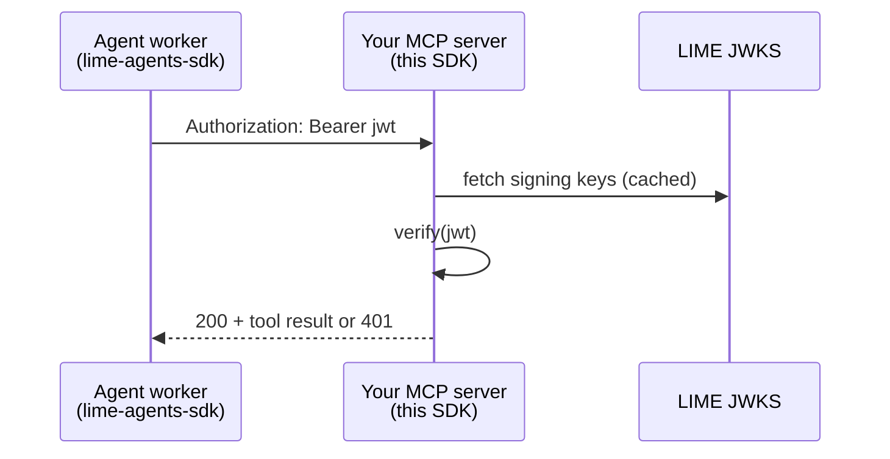

# lime-mcp-server-sdk

Verify **LIME MCP passport JWTs** on your resource server — local JWKS, no LIME hop on the hot path.

```python
from lime_mcp_server import TokenVerifier

verifier = TokenVerifier(expected_domain="tools.example.com")
result = verifier.verify(bearer_token)
if result.is_valid:
    agent_id = result.agent_id  # then YOUR ACL
```

[](https://pypi.org/project/lime-mcp-server-sdk/)
[](https://lime-mcp-server-sdk.readthedocs.io/)
[](https://github.com/Mawyxx/lime-mcp-server-sdk)

## Who is this for?

You run an **MCP resource server**. Agents call with `Authorization: Bearer <jwt>`.
This SDK answers: is this JWT from LIME for **this** host, and which `agent_id`?

!!! warning "This SDK does not"
    - Issue tokens → [lime-agents-sdk](https://lime-agents-sdk.readthedocs.io/)
    - Website login → [lime-sites-sdk](https://lime-sites-sdk.readthedocs.io/)

## Mental model

```text
TokenVerifier
├── verify / verify_async   ← primary
├── warmup()                ← production
└── cache helpers           ← advanced
```

## Flow



## Install

```bash
pip install lime-mcp-server-sdk
export LIME_EXPECTED_DOMAIN=tools.example.com
```

## Next pages

1. [Quick Start](quickstart.md)
2. [API Reference](api.md)
3. [Examples](examples.md)

Platform: [lime.pics/docs](https://lime.pics/docs#guide-mcpServerSdk)
